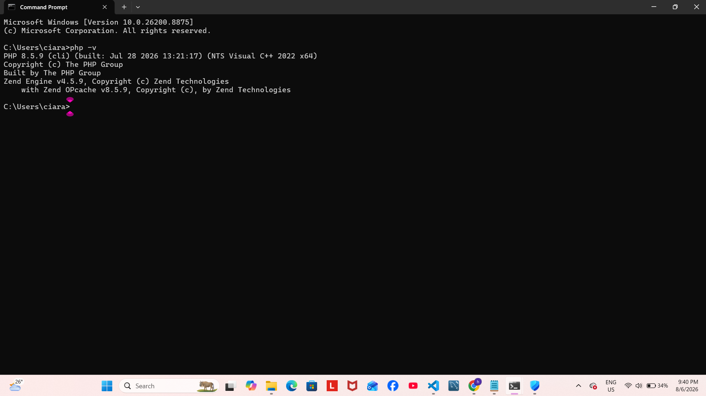
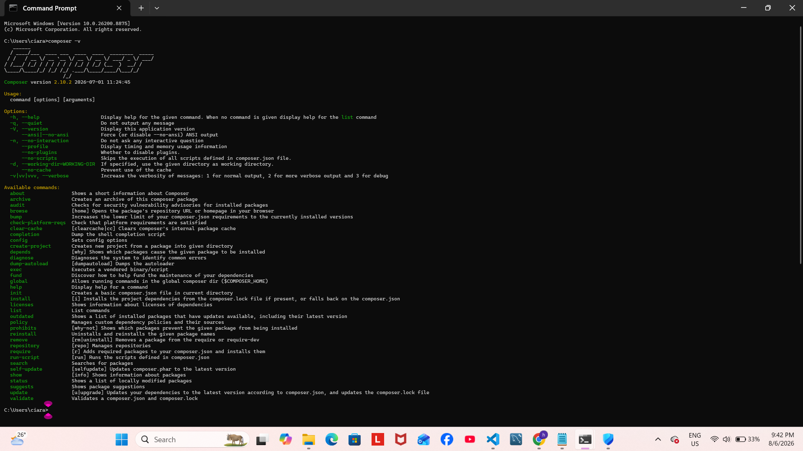
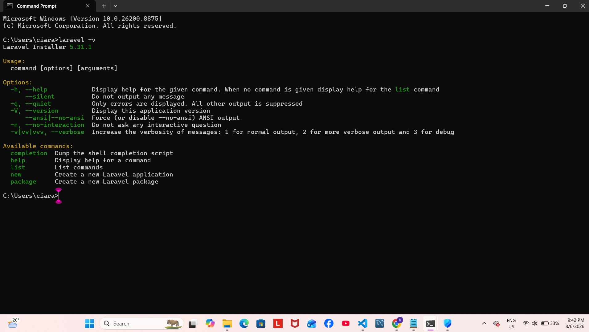
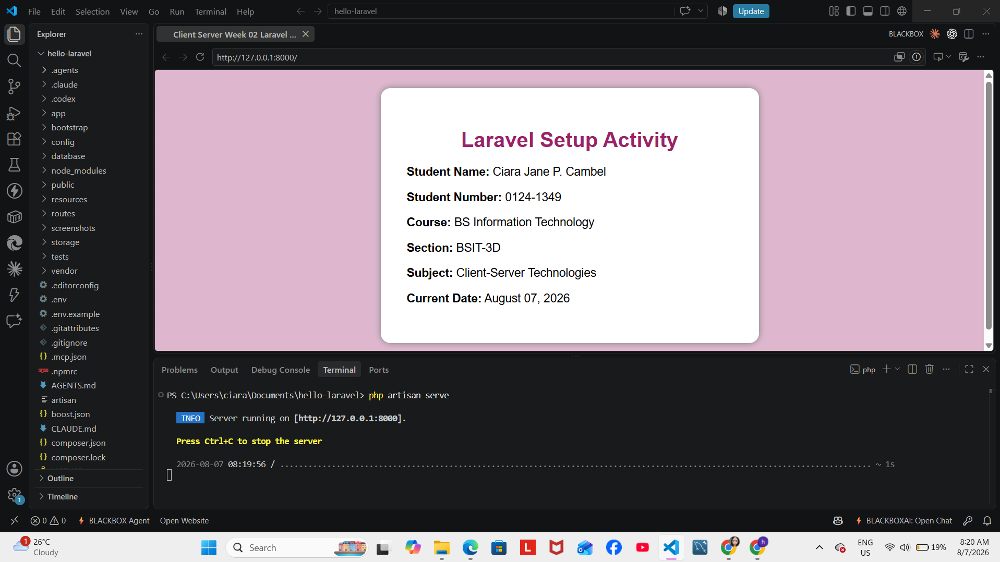
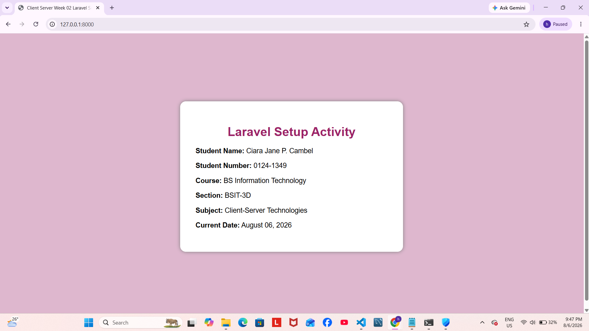
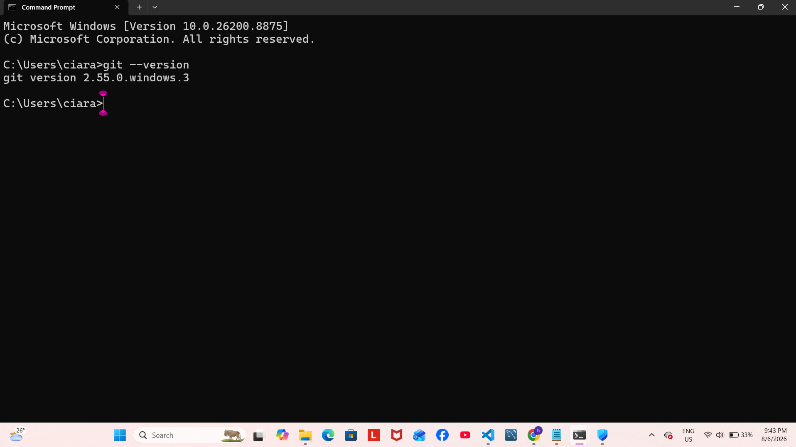
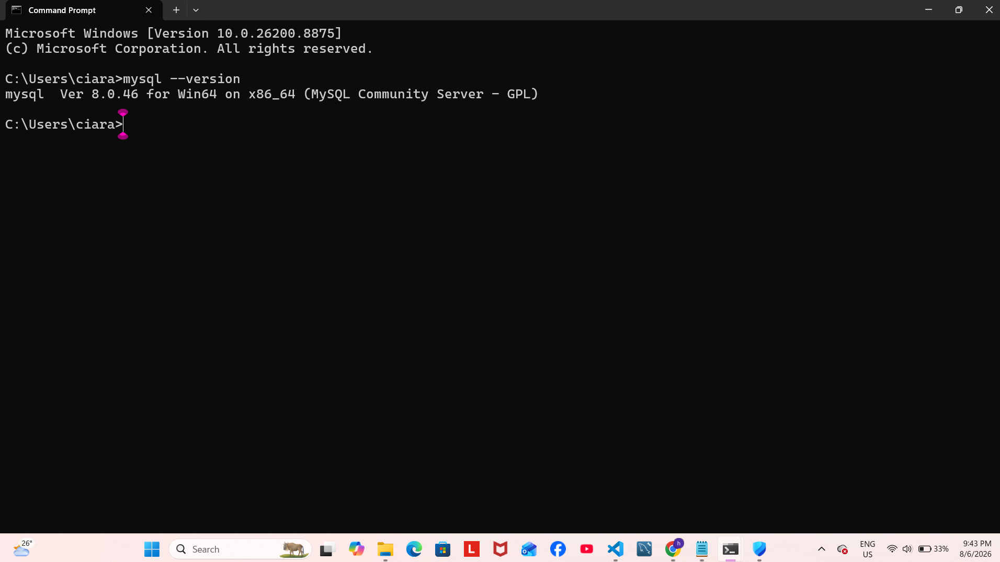
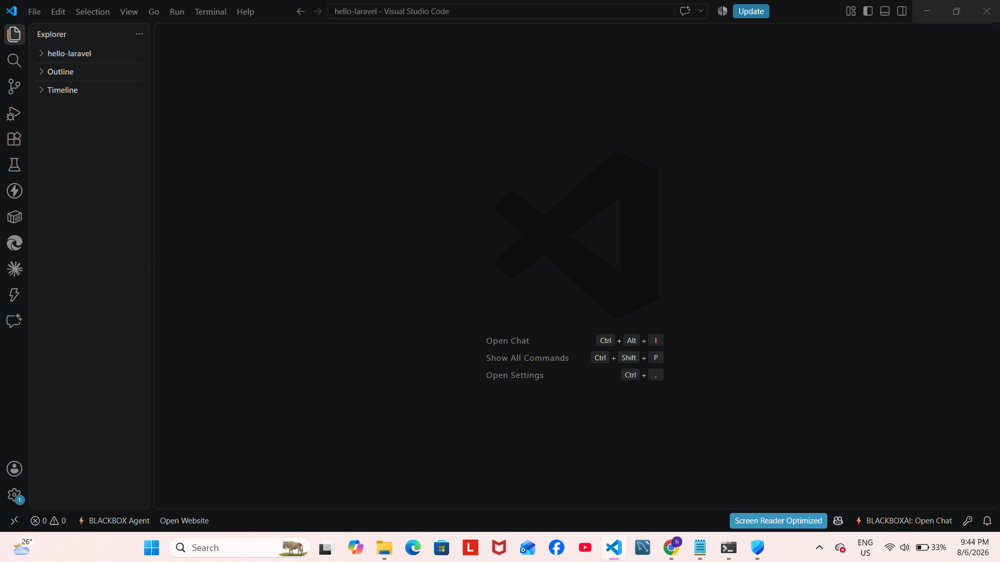

#  ITST 302 - Client-Server Technologies 

# 1. Mini Project 01: Professional Laravel Development Environment Setup / 

#  2. Introduction
- Laravel is a PHP framework designed to help developers build web applications in a structured and efficient way. It follows the Model-View-Controller (MVC) design pattern, which separates different parts of an application to make the code easier to understand, maintain, and expand. Laravel also includes built-in tools for routing, database operations, authentication, and security, allowing developers to focus more on application development.
- Most modern websites and web applications rely on the client-server model. In this setup, the client, such as a web browser, sends requests to a server, which processes the request and returns the necessary information.
- The purpose of this activity is to prepare a Laravel development environment by installing the required software, creating a mini Laravel project application, and exploring the framework's basic project structure. It also aims to develop practical skills in using Git for version control and documenting the installation process.

# 3. Objectives
- 1. I succesfully downloaded all the required software.
- 2. I Have run my first laravel application.
- 3. I have created my first mini project which is the homepage.
- 4. I was able to practice using git and github to upload my project files.
- 5. I am slowly but surely learning.

# 4. Development Environment
- Operating System: Windows 11
- PHP: 8.5.9
- Laravel: 5.35.1
- Composer: 2.10.2
- Git: 2.55.0.windows.3
- MySQL: Ver 8.0.46 for Win64 on x86_64 (MySQL Community Server - GPL)
- Visual Studio Code: 1.132.0
df53daabb18cd157bdb08c7f01c34df936cf12f4
x64

# 5. Installation Steps
- I succesfully installed PHP and confirmed that it was working from the command line.

- I installed Composer and set it up to manage PHP packages and dependencies.

- I installed the Laravel framework, i also set it up.

- I checked if the laravel is working then i proceed in creating my mini Laravel project.
- I started the development server using php artisan serve.

- I opened the application in a web browser to verify that the installation was successful.

- Then all together, i opened and used my command line to know if everything is recognized and properly working.

# 6. Project Structure
- app/ Stores the application's core logic, including controllers, models, middleware, and other classes responsible for processing requests.
- routes/ Contains the route definitions that determine how incoming URLs are handled by the application.
- resources/ Includes Blade templates, frontend assets, and language files used to build the user interface.
- public/ Contains publicly accessible files such as images, CSS, JavaScript, and the application's entry point.
- config/ Stores configuration files that define settings for the application's services and features.
- database/ Contains migration files, factories, and seeders used for creating and populating the database.

# 7. Problems Encountered
- PHP is not recognized

# 8. Solutions
- i deactivate the windows security because its blocking some stuff of the php files.

# 9. Screenshots
- PHP installation - 
- Composer installation - 
- Laravel installation - 
- Git Installation - 
- MySQL installation - 
- VSCode installation - 
- Artisan serve checking - 
- Laravel Project Homepage - 

# 10. Reflection
    - Setting up the Laravel development environment gave me a better understanding of the software required for PHP web development. Before completing this activity, I knew that web applications depended on several tools, but I had not experienced configuring them together in a single project. Installing PHP, Composer, Laravel, Git, MySQL, and Visual Studio Code helped me understand how each tool contributes to the overall development process.
    - One challenge I encountered was ensuring that every program was correctly installed and recognized by the command line. There were moments when commands did not work as expected because of missing environment variables or incomplete installation steps. Solving these issues required careful reading of documentation and checking each configuration one at a time. Although troubleshooting took additional time, it improved my confidence in identifying and resolving technical problems.
    - Learning Laravel also helped me appreciate the role of client-server technologies in modern web development. Every request made by a user is processed by the server before a response is returned to the browser. Laravel simplifies this process by providing an organized framework that includes routing, database management, authentication, and many other useful features. These built-in capabilities make application development more efficient while encouraging good coding practices.
    - Overall, this activity strengthened my understanding of the tools and workflow used in professional web development. The experience of installing, configuring, documenting, and managing the project with Git prepared me for future software development projects. I believe the knowledge gained from this exercise will make it easier to build more advanced web applications and collaborate with others using industry-standard development practices.

# 11. References
- Laravel. (2025). Laravel documentation. https://laravel.com/docs
- Composer. (2025). Documentation. https://getcomposer.org/doc/
- PHP. (2025). PHP manual. https://www.php.net/docs.php
- Git. (2025). Git documentation. https://git-scm.com/doc

